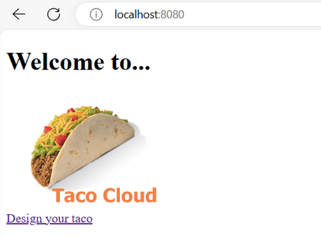
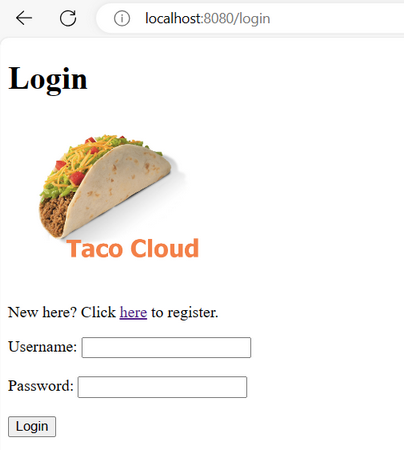
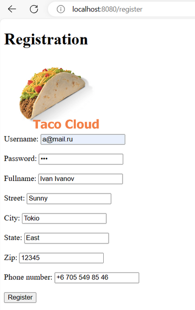
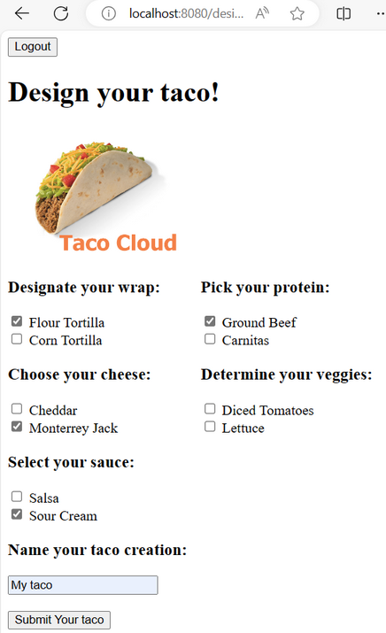
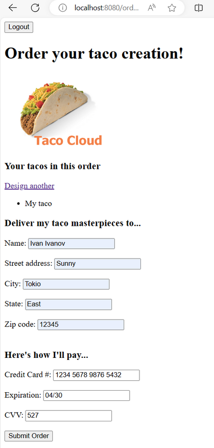
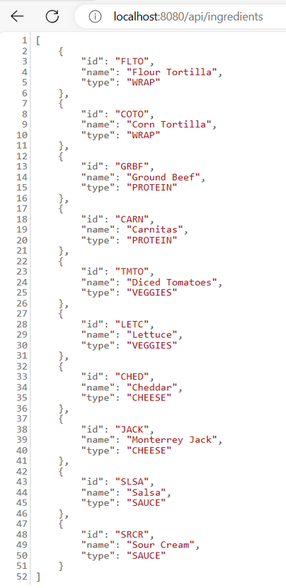
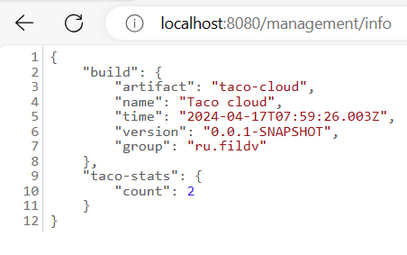

# Taco cloud

This project is based on the book "Spring in Action" (by Walls C.).

This web application allows you to create taco orders.

### <u>Run guide:</u>

#### To build the project:

* .\mvnw clean package

#### To execute the app:

* docker build . -t tacocloud:1.0
* docker run --rm -p8080:8080 -d tacocloud:1.0

#### Type in your browser: http://localhost:8080

### <u>Technology stack:</u>

* Java: JDK 17
* Framework: Spring boot 3 (web, validation, jpa, security, data-rest, actuator)
* Build: Maven
* ORM: Hibernate
* DB: H2
* Containers: Docker
* Front: Thymeleaf
* Library: Lombok

Application view

---

---

---

---

---

---

